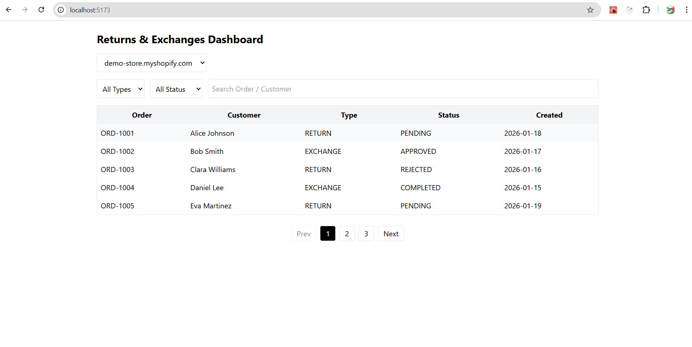
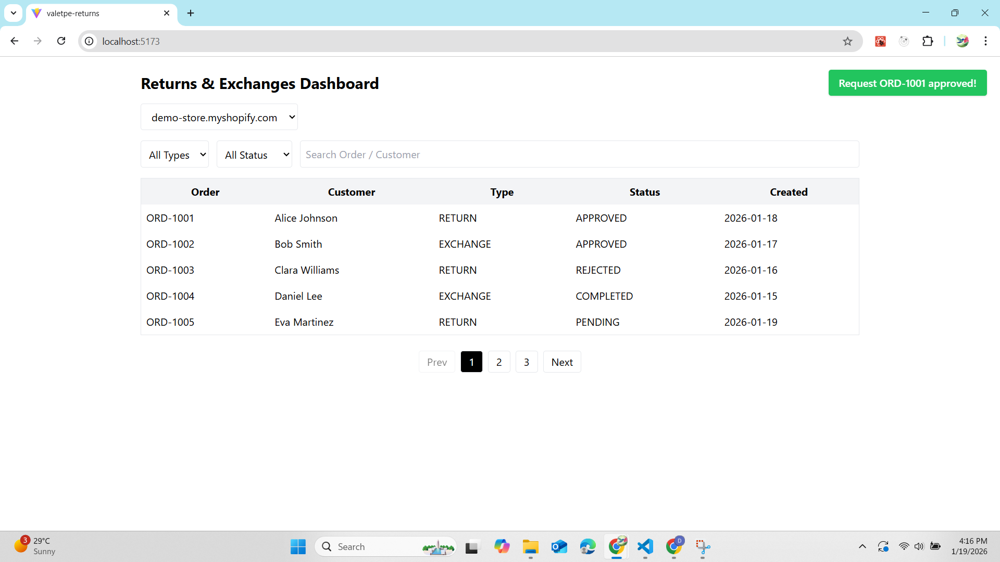

# Shopify Returns & Exchanges Dashboard

A **standalone React + TypeScript dashboard** simulating a Shopify merchant interface for managing return and exchange requests across multiple stores.

> ⚠️ This app uses **mock data** and simulates backend interactions for demo purposes.

---

## 🛠 Tech Stack

* **React + TypeScript**
* **Vite**
* **Tailwind CSS**
* **React Router**
* **Custom Hooks:** `useRequests`, `useToast`
* **Mock API:** `services/api.ts`

> No Shopify App Bridge or authentication — this is a **standalone simulation**.

---

## 📦 Features

1. **Store Selector** – Switch between multiple Shopify stores
   (e.g., `demo-store.myshopify.com`, `fashion-hub.myshopify.com`)
2. **Returns & Exchanges Dashboard** – View request list with filters
   (`Request Type`, `Status`) and search (`Order ID`, `Customer Name`)
3. **Request Details & Actions** – Open modal for details, approve / reject / complete actions with **valid state transitions**
4. **Pagination** – Client-side pagination for better UX with large datasets
5. **Toast Notifications** – Feedback for every action (approve / reject / complete)
6. **Responsive UI** – Optimized for desktop and mobile

---

## ⚙️ Setup Instructions

1. Clone the repository:

```bash
git clone https://github.com/<your-username>/shopify-returns-dashboard.git
cd shopify-returns-dashboard
```

2. Install dependencies:

```bash
npm install
```

3. Start the development server:

```bash
npm run dev
```

4. Open [http://localhost:5173](http://localhost:5173) in your browser.

---

## 🧠 Architecture Decisions

### Mock API Layer

* `services/api.ts` simulates backend behavior using Promises and timeout delays
* Separates **data logic** from UI
* Can be replaced with real APIs without UI changes

### Custom Hooks

* **`useRequests`**

  * Fetches requests by shop
  * Handles filtering, search, and pagination
  * Keeps components focused on presentation
* **`useToast`**

  * Centralized toast notification system
  * Provides consistent UX feedback

### Component Structure

* `RequestTable` – Displays paginated requests
* `RequestDetailsModal` – Shows request details and actions
* `Pagination` – Reusable pagination component
* `StoreSelector` – Manages multi-store context

### State Management

* Local state with React hooks
* Global context only for toast notifications
* Lightweight and easy to reason about

### TypeScript-First Approach

* Strong typing with interfaces and union types
* Core entities:

  * `ReturnExchangeRequest`
  * `RequestStatus`
  * `RequestType`
* Prevents invalid state transitions at compile time

---

## 🔗 Integration with a Real Backend

In a production Shopify app:

### 1. OAuth Flow

* Handled by the backend
* Shopify provides:

  * Shop domain
  * Access token
* Frontend communicates only with authenticated backend APIs

### 2. API Communication

Backend endpoints replace the mock API:

* `GET /requests?shop=demo-store.myshopify.com`
* `PATCH /requests/:id`

Frontend logic remains unchanged.

### 3. Webhooks

* Shopify webhooks notify backend of:

  * New orders
  * Return / exchange events
* Backend updates the database
* Frontend fetches the latest data

### 4. Embedded vs Standalone

* **Embedded App**

  * Runs inside Shopify Admin
  * Uses Shopify App Bridge
* **Standalone App (current)**

  * Runs independently
  * Supports multiple shops
  * Suitable for internal dashboards

---

## 📸 Screenshots & Demo

### Dashboard View



### Request Details Modal


### Toast Notifications



### 🎥 Demo Video

[Watch the demo video](https://youtu.be/7E26WvFJusI)

> The demo shows store switching, filtering, request status updates, pagination, and toast notifications.
