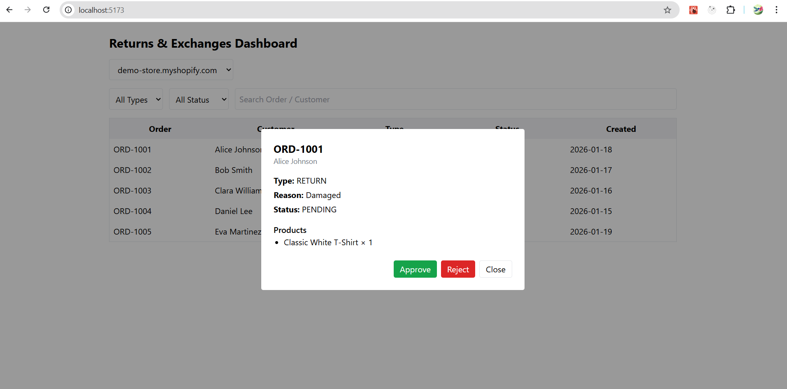

````markdown
# Shopify Returns & Exchanges Dashboard 

A **standalone React + TypeScript dashboard** simulating a Shopify merchant interface for managing return and exchange requests across multiple stores.

> ⚠️ This app uses **mock data** and simulates backend interactions for demo purposes.

---

## 🛠 Tech Stack

- **React + TypeScript**
- **Vite**
- **Tailwind CSS**
- **React Router**
- **Custom Hooks:** `useRequests`, `useToast`
- **Mock API:** `services/api.ts`

> No Shopify App Bridge or authentication — this is a **standalone simulation**.

---

## 📦 Features

1. **Store Selector** – Switch between multiple Shopify stores (e.g., `demo-store.myshopify.com`, `fashion-hub.myshopify.com`).
2. **Returns & Exchanges Dashboard** – View request list with filters (`Request Type`, `Status`) and search (`Order ID`, `Customer Name`).
3. **Request Details & Actions** – Open modal for details, approve/reject/complete actions with **valid state transitions**.
4. **Pagination** – Client-side pagination for better UX with many requests.
5. **Toast Notifications** – Feedback for every action (approve/reject/complete).
6. **Responsive UI** – Clean, usable on mobile and desktop.

---

## ⚙️ Setup Instructions

1. Clone the repository:

```bash
git clone <repo-url>
cd valetpe-returns-dashboard
````

2. Install dependencies:

```bash
npm install
```

3. Start the development server:

```bash
npm run dev
```

4. Open [http://localhost:5173](http://localhost:5173) in your browser.

---

## Architecture Decisions

* **Mock API Layer (`services/api.ts`)** – Simulates backend calls with promises and timeout delays, separating **data logic** from UI.
* **Custom Hooks**

  * `useRequests` – Fetch, filter, search, and paginate requests; keeps components focused on presentation.
  * `useToast` – Global toast notifications for user feedback.
* **Component Design**

  * `RequestTable` – Displays paginated requests.
  * `RequestDetailsModal` – Shows details & actions.
  * `Pagination` – Reusable pagination component.
  * `StoreSelector` – Manages multi-store context.
* **State Management** – Local state + React hooks; global context only for **toasts**, keeping it lightweight.
* **TypeScript First** – Strict typing with union types and interfaces for all entities (`ReturnExchangeRequest`, `RequestStatus`, `RequestType`).

---

## 🔗 Integration with a Real Backend

In a production Shopify app:

1. **OAuth Flow**

   * Handled by the backend.
   * On install, Shopify provides a **shop domain** and **access token**.
   * Frontend only talks to backend APIs with shop-specific credentials.

2. **API Communication**

   * Backend exposes endpoints for:

     * Fetching requests by shop (`GET /requests?shop=demo-store`)
     * Updating request status (`PATCH /requests/:id`)
   * Frontend calls these endpoints instead of the mock API.

3. **Webhooks**

   * Shopify webhooks can notify the backend about new orders, returns, or exchanges.
   * Backend updates the database, which the frontend then fetches.

4. **Embedded vs Standalone**

   * **Embedded** – Runs inside Shopify admin using App Bridge.
   * **Standalone** – Runs independently (current approach), can support multiple shops and internal dashboards.

```

## 📸 Screenshots & Demo

### Dashboard View


### Request Details Modal


### Toast Notifications


### Demo Video
[Watch the demo video](https://youtu.be/7E26WvFJusI)

> The video demonstrates switching stores, filtering requests, updating request status, pagination, and toast notifications in action.

